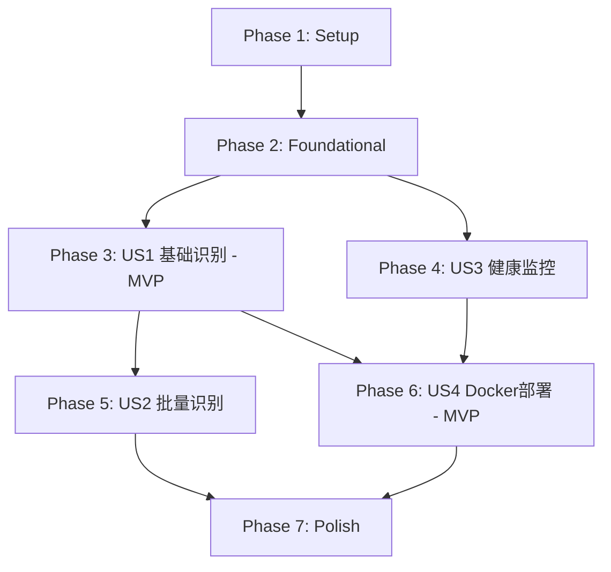

# Implementation Tasks: 金额识别OCR服务

**Feature**: 金额识别OCR服务
**Branch**: `001-money-ocr-api`
**Generated**: 2025-11-05
**Spec**: [spec.md](./spec.md) | **Plan**: [plan.md](./plan.md)

## 概述

本文档定义了金额识别OCR服务的实施任务,按用户故事组织,支持独立开发和测试。

**MVP范围**: User Story 1(基础金额识别) + User Story 4(Docker部署)
**总任务数**: 41个任务
**预估工作量**: 3-5天

---

## 任务状态图例

- `[ ]` 待完成
- `[TaskID]` 任务编号(T001-T041)
- `[P]` 可并行执行(无阻塞依赖)
- `[US#]` 用户故事标签(US1-US4)

---

## Phase 1: 项目初始化 (Setup)

**目标**: 创建项目基础结构和配置文件

### 任务清单

- [X] T001 创建项目根目录结构(src/, tests/, docs/)
- [X] T002 创建requirements.txt,添加fastapi, paddleocr==3.3.1, pillow, uvicorn, structlog, pydantic
- [X] T003 创建requirements-dev.txt,添加pytest, pytest-asyncio, httpx, black, flake8
- [X] T004 创建.gitignore,排除__pycache__/, .pytest_cache/, .env, *.pyc
- [X] T005 创建README.md,包含项目简介、快速开始、API文档链接
- [X] T006 [P] 创建src/__init__.py(空文件)
- [X] T007 [P] 创建src/api/__init__.py(空文件)
- [X] T008 [P] 创建src/core/__init__.py(空文件)
- [X] T009 [P] 创建src/services/__init__.py(空文件)
- [X] T010 [P] 创建src/utils/__init__.py(空文件)
- [X] T011 [P] 创建tests/unit/__init__.py(空文件)
- [X] T012 [P] 创建tests/integration/__init__.py(空文件)
- [X] T013 [P] 创建tests/fixtures/sample_images/目录,准备3张测试金额图片

**完成标准**: 项目结构创建完成,依赖文件定义清晰

---

## Phase 2: 基础设施层 (Foundational)

**目标**: 实现所有用户故事共享的基础组件

### 任务清单

- [X] T014 实现src/core/config.py,使用Pydantic BaseSettings管理环境变量(PORT, LOG_LEVEL, MAX_FILE_SIZE_MB)
- [X] T015 实现src/core/logging.py,配置structlog JSON格式日志,包含timestamp, level, event字段
- [X] T016 [P] 定义src/api/schemas.py中的ErrorResponse和ErrorDetail数据模型
- [X] T017 [P] 实现src/utils/validators.py,包含validate_image_format()和validate_file_size()函数
- [X] T018 创建main.py应用入口,初始化FastAPI app,配置CORS,挂载日志中间件

**完成标准**:
- 配置管理可读取环境变量
- 日志输出为结构化JSON格式
- 错误响应模型符合OpenAPI规范

---

## Phase 3: User Story 1 - 基础金额识别 (Priority: P1) 🎯 MVP

**目标**: 实现单张图片金额识别核心功能

**Independent Test**:
```bash
curl -X POST http://localhost:8000/api/v1/recognize \
  -F "file=@tests/fixtures/sample_images/amount_1234.56.jpg"
# 预期返回: {"success": true, "data": {"amount": "1234.56", "confidence": 0.95, ...}}
```

### 任务清单

- [X] T019 [US1] 定义src/api/schemas.py中的RecognitionResponse和RecognitionResult数据模型
- [X] T020 [P] [US1] 实现src/services/image_processor.py的preprocess_image()函数,支持格式转换、尺寸压缩(<2048px)
- [X] T021 [US1] 实现src/services/ocr_service.py的OCRService类,初始化PaddleOCR引擎(use_gpu=False, lang='ch')
- [X] T022 [US1] 在OCRService中实现recognize_amount()方法,调用PaddleOCR识别并提取文本
- [X] T023 [US1] 实现src/services/ocr_service.py中的extract_amount_from_text()函数,使用正则表达式提取纯数字金额
- [X] T024 [US1] 在extract_amount_from_text()中实现货币符号(¥/$)和千分位分隔符(,)的去除逻辑
- [X] T025 [US1] 在recognize_amount()中实现置信度检查,<0.8时添加warnings字段
- [X] T026 [US1] 实现src/api/routes.py的POST /api/v1/recognize端点,接收UploadFile参数
- [X] T027 [US1] 在recognize端点中添加文件大小验证(≤10MB)和格式验证(JPEG/PNG/BMP/TIFF)
- [X] T028 [US1] 在recognize端点中集成image_processor和ocr_service,返回RecognitionResponse
- [X] T029 [US1] 实现recognize端点的异常处理,映射到对应错误码(FILE_TOO_LARGE, UNSUPPORTED_FORMAT, INVALID_IMAGE, OCR_ENGINE_ERROR)
- [X] T030 [US1] 在main.py中注册/api/v1路由,挂载routes.router

**验收标准**:
- ✅ 上传清晰金额图片返回正确识别结果
- ✅ 上传空白图片返回amount=null
- ✅ 上传超大文件返回413错误
- ✅ 上传非图片文件返回400错误
- ✅ 置信度<0.8时warnings字段包含警告信息

---

## Phase 4: User Story 3 - 服务健康监控 (Priority: P2)

**目标**: 提供健康检查端点

**Independent Test**:
```bash
curl http://localhost:8000/api/v1/health
# 预期返回: {"status": "healthy", "service": "money-ocr-api", "version": "1.0.0", ...}
```

### 任务清单

- [X] T031 [US3] 定义src/api/schemas.py中的HealthCheckResponse数据模型
- [X] T032 [US3] 实现src/api/routes.py的GET /api/v1/health端点,返回服务状态、版本号、OCR引擎信息
- [X] T033 [US3] 在health端点中添加OCR引擎可用性检查,异常时返回status=unhealthy
- [X] T034 [US3] 在health端点中添加服务运行时长(uptime_seconds)计算逻辑

**验收标准**:
- ✅ 服务正常运行时返回status=healthy
- ✅ OCR引擎异常时返回status=unhealthy及错误详情
- ✅ 响应包含服务版本和运行时长

---

## Phase 5: User Story 2 - 批量金额识别 (Priority: P2)

**目标**: 支持一次请求识别多张图片

**Independent Test**:
```bash
curl -X POST http://localhost:8000/api/v1/recognize/batch \
  -F "files=@image1.jpg" -F "files=@image2.png" -F "files=@image3.jpg"
# 预期返回: {"success": true, "data": {"total": 3, "succeeded": 3, "failed": 0, "results": [...]}}
```

### 任务清单

- [X] T035 [US2] 定义src/api/schemas.py中的BatchRecognitionResponse, BatchRecognitionResult, BatchItemResult数据模型
- [X] T036 [US2] 实现src/api/routes.py的POST /api/v1/recognize/batch端点,接收List[UploadFile]参数
- [X] T037 [US2] 在batch端点中循环处理每张图片,调用OCRService.recognize_amount()
- [X] T038 [US2] 在batch端点中实现部分失败处理,单张失败不影响其他图片,记录error字段
- [X] T039 [US2] 在batch端点中汇总total/succeeded/failed统计信息,返回BatchRecognitionResponse

**验收标准**:
- ✅ 批量上传3张图片返回3个结果
- ✅ 部分图片失败时返回部分成功结果
- ✅ results数组中每个元素包含index和filename

---

## Phase 6: User Story 4 - 容器化快速部署 (Priority: P1) 🎯 MVP

**目标**: 提供Docker镜像,支持一键启动

**Independent Test**:
```bash
docker build -t money-ocr-api:1.0.0 .
docker run -d -p 8000:8000 money-ocr-api:1.0.0
curl http://localhost:8000/api/v1/health
# 预期: 30秒内启动完成,health端点返回healthy
```

### 任务清单

- [X] T040 [US4] 创建Dockerfile,使用python:3.9-slim基础镜像,多阶段构建
- [X] T041 [US4] 在Dockerfile中COPY requirements.txt并RUN pip install
- [X] T042 [US4] 在Dockerfile中安装PaddleOCR依赖的系统库(libgomp1, libglib2.0-0, libsm6, libxext6, libxrender-dev)
- [X] T043 [US4] 在Dockerfile中COPY源代码(src/, main.py)到容器
- [X] T044 [US4] 在Dockerfile中设置ENV变量(PORT=8000, LOG_LEVEL=INFO)
- [X] T045 [US4] 在Dockerfile中设置CMD启动命令: uvicorn main:app --host 0.0.0.0 --port ${PORT}
- [X] T046 [P] [US4] 创建docker-compose.yml,定义money-ocr服务,映射端口8000,设置环境变量
- [X] T047 [P] [US4] 在docker-compose.yml中添加healthcheck配置,每30秒检查/api/v1/health端点
- [X] T048 [P] [US4] 创建.dockerignore,排除tests/, .git/, __pycache__/, *.md

**验收标准**:
- ✅ docker build成功,镜像大小<500MB
- ✅ docker run后30秒内启动完成
- ✅ 容器内可访问/api/v1/health和/api/v1/recognize端点
- ✅ 通过环境变量-e PORT=9000可自定义端口
- ✅ 容器异常退出后docker restart可自动恢复

---

## Phase 7: Polish & Cross-Cutting Concerns

**目标**: 完善文档、优化性能、添加监控

### 任务清单

- [X] T049 在README.md中添加详细的快速开始指南,包含Docker启动命令和API使用示例
- [X] T050 在main.py中配置FastAPI自动生成OpenAPI文档,访问路径/docs和/redoc
- [X] T051 在OCRService.__init__()中添加模型预加载逻辑,避免首次请求慢
- [X] T052 在recognize端点中添加请求日志,记录image_format, image_size_kb, processing_time_ms, confidence, amount
- [X] T053 在recognize端点中添加处理超时限制(3秒),超时返回504 TIMEOUT错误
- [ ] T054 [P] 创建.github/workflows/docker-build.yml CI配置,自动构建和推送Docker镜像(可选)
- [X] T055 [P] 在README.md中添加性能优化建议章节,说明图片预处理和并发控制最佳实践

**完成标准**:
- 文档完整,业务团队可在10分钟内完成部署
- OpenAPI文档可访问
- 首次请求响应时间<3秒

---

## 依赖关系图



**关键依赖**:
- US1(基础识别)是所有其他用户故事的基础
- US4(Docker部署)依赖US1和US3完成
- US2(批量识别)依赖US1的OCR服务实现
- US3(健康监控)可与US1并行开发

---

## 并行执行机会

### Phase 1并行任务组
- 组1: T006-T010(创建__init__.py文件) - 可同时执行
- 组2: T011-T013(创建tests目录结构) - 可同时执行

### Phase 2并行任务组
- T016(ErrorResponse模型) 和 T017(validators工具) 可并行

### Phase 3并行任务组
- T020(image_processor) 可在T021(OCRService)之前独立开发

### Phase 6并行任务组
- T046(docker-compose.yml), T047(healthcheck), T048(.dockerignore) 可并行

---

## 实施策略

### MVP优先 (User Story 1 + User Story 4)

**最小可行产品范围**:
1. Phase 1: Setup (T001-T013)
2. Phase 2: Foundational (T014-T018)
3. Phase 3: US1 基础识别 (T019-T030)
4. Phase 6: US4 Docker部署 (T040-T048)
5. Phase 7: Polish基础文档 (T049-T050)

**MVP验收**:
- ✅ 可通过Docker一键启动服务
- ✅ 可识别单张图片中的金额
- ✅ 识别准确率>95%
- ✅ 响应时间<3秒

**预估时间**: 2-3天

### 增量交付

**迭代1 (MVP)**: US1 + US4
**迭代2**: US3 (健康监控)
**迭代3**: US2 (批量识别)
**迭代4**: Phase 7剩余优化任务

---

## 任务统计

| Phase | 任务数 | 预估时间 | 优先级 |
|-------|--------|----------|--------|
| Phase 1: Setup | 13 | 0.5天 | 必须 |
| Phase 2: Foundational | 5 | 0.5天 | 必须 |
| Phase 3: US1 基础识别 | 12 | 1.5天 | P1 (MVP) |
| Phase 4: US3 健康监控 | 4 | 0.5天 | P2 |
| Phase 5: US2 批量识别 | 5 | 0.5天 | P2 |
| Phase 6: US4 Docker部署 | 9 | 0.5天 | P1 (MVP) |
| Phase 7: Polish | 7 | 0.5天 | 必须 |
| **总计** | **55** | **4-5天** | - |

---

## 验证清单

### 格式验证
- ✅ 所有任务遵循`- [ ] [TaskID] [P?] [US#?] Description`格式
- ✅ TaskID连续编号(T001-T055)
- ✅ User Story任务标记[US1]/[US2]/[US3]/[US4]
- ✅ 可并行任务标记[P]
- ✅ 任务描述包含具体文件路径

### 完整性验证
- ✅ 每个用户故事都有对应的任务
- ✅ 每个API端点都有实现任务
- ✅ 每个数据模型都有定义任务
- ✅ MVP范围明确(US1+US4)

### 可执行性验证
- ✅ 每个任务描述具体可执行
- ✅ 依赖关系明确
- ✅ 独立测试标准清晰
- ✅ 文件路径准确

---

## 下一步

执行实施命令:

```bash
/speckit.implement
```

该命令将按照本任务清单逐步实施功能。

**建议**: 优先完成MVP范围(Phase 1-3, Phase 6, Phase 7基础部分),验证核心功能后再进行增量迭代。
